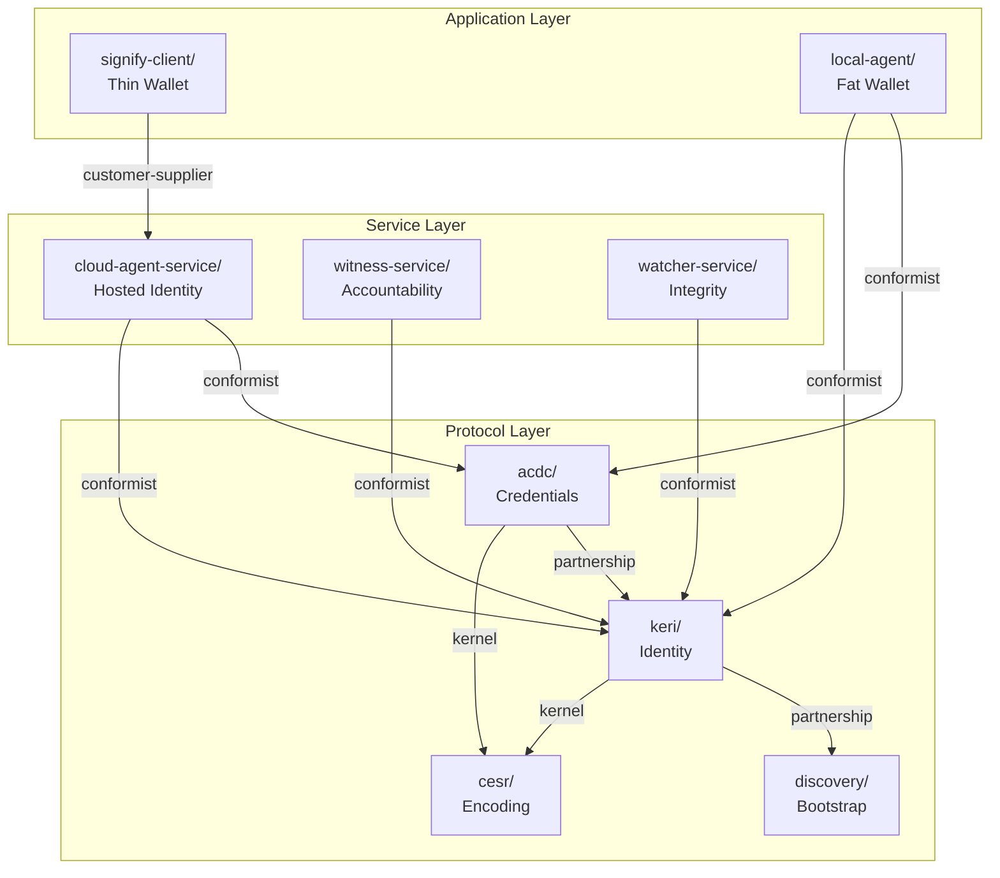
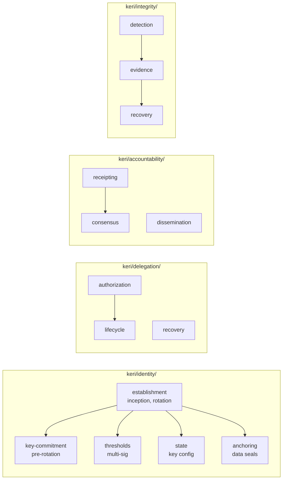
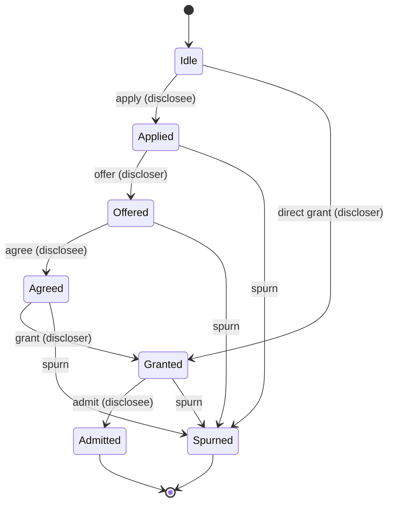

# keri-claude

A Claude Code **plugin** and **domain-driven design specification** for the KERI (Key Event Receipt Infrastructure) ecosystem. Provides 16 skills for protocol implementation and a complete 48-domain DDD spec designed for AI-driven development in any language.

## What's Here

**Two things in one repo:**

1. **Skills Plugin** — 16 Claude Code skills covering protocol specs, implementation APIs, coding conventions, and architecture planning
2. **DDD Specification** — A complete domain-driven design specification of the KERI ecosystem (48 domains, 560 UL terms, 202 typed errors, 61 formal types with 433 fields, 17 cross-domain protocols with 216 typed references, 21 state machines, 619 verification properties) — designed to be the input for AI-assisted implementation in any language

## DDD Specification

The `rdod/spec/domains/` directory contains a complete DDD decomposition of the KERI ecosystem — CESR encoding, KERI identity protocol, ACDC credentials, and all service/application tiers.

### The Adopter's Story

> **CESR** is how all data is encoded — self-describing cryptographic primitives that compose into messages.
>
> **KERI** gives you a cryptographic **identity** you control, with **delegation** for hierarchical trust, **accountability** through witnesses, and **integrity** through watchers.
>
> **ACDC** lets you issue **credentials** that prove things about your identity, **exchange** them with others through structured negotiation, and protect **privacy** through graduated disclosure.
>
> **Discovery** bootstraps it all — finding other identifiers' endpoints so you can start communicating.
>
> You deploy this via **services** (cloud agents, witnesses, watchers) and interact through **applications** (thin wallets that keep keys safe at the edge, or fat wallets that run everything locally).

### Architecture



### KERI Identity Subdomains



### IPEX Credential Exchange Flow



### Domain Map

```
PROTOCOL LAYER
  cesr/                              How data is encoded
    primitives/                        Self-describing crypto types
    composition/                       Composing primitives into messages

  keri/                              How you prove who you are
    identity/                          Create and manage identifiers
      establishment                      inception, rotation
      key-commitment                     pre-rotation (future key safety)
      thresholds                         multi-sig requirements
      state                              current key configuration
      anchoring                          binding data to your identifier
    delegation/                        Hierarchical trust
      authorization                      delegator approves/denies
      lifecycle                          delegated inception/rotation
      recovery                           superseding rules
    accountability/                    Others can verify your claims
      receipting                         witnesses sign what they saw
      consensus                          enough witnesses agree (KAWA)
      dissemination                      spreading events to validators
    integrity/                         Detecting and recovering from compromise
      detection                          finding forks in event logs
      evidence                           collecting proof of duplicity
      recovery                           honest controller wins

  acdc/                              How you prove what's true about you
    credential-lifecycle/              Issue, track, revoke credentials
      status                             active or revoked?
      verification                       ACDC -> TEL -> KEL chain
      registry                           creating/managing registries
    credential-exchange/               Share credentials with others
      negotiation                        apply/offer/agree/grant/admit
      proof                              Proof of Issuance, Proof of Disclosure
    privacy/                           Control what you reveal
      disclosure                         graduated: compact -> partial -> full
      blinding                           hidden credential status
      aggregation                        selective disclosure mechanics

  discovery/                         How you find others

SERVICE LAYER
  cloud-agent-service/               Hosted identity management
    api/                               3 ports: boot, admin, message router
    provisioning/                      multi-tenant agent lifecycle
    processing/                        async pipeline orchestration

  witness-service/                   Accountability infrastructure
    api/                               receives events, returns receipts

  watcher-service/                   Integrity infrastructure
    api/                               collects KELs, reports duplicity

APPLICATION LAYER
  signify-client/                    Thin wallet — keys at the edge
    key-management/                    passcode, keepers, tiers
    resources/                         API surface for identifiers, credentials

  local-agent/                       Fat wallet — everything local
    api/                               CLI + direct interface
```

### Spec Artifacts Per Domain

Each domain directory contains up to 8 spec files:

| File | Purpose | Coverage |
|------|---------|----------|
| `domain.yaml` | Identity, relationships, published language, guidance | 48/48 |
| `ubiquitous-language.yaml` | Detailed terms with invariants, examples, imports, specializes | 48/48 |
| `ports.yaml` | Inbound/outbound interfaces with contracts | 48/48 |
| `verification.yaml` | Formal properties, port contracts, state machines | 48/48 |
| `errors.yaml` | Typed error taxonomy with cause, recovery, context | 42/48 |
| `types.yaml` | Formal data structures with field constraints and variants | 24/48 |
| `protocols.yaml` | Cross-domain orchestration flows with typed references | 7/48 |
| `context-map.html` | Interactive Cytoscape visualization of all 48 domains | 1 |

### Key Design Decisions

**Adopter-centric naming** — Every domain is named for the job it does, not the mechanism it uses. `event-log` became `identity`. `duplicity-detection` became `integrity`. `tel` became `credential-lifecycle`. The spec vocabulary is encapsulated inside understandable domain concepts.

**Language independence** — Domain terms are primary (`Identity State Machine`), implementation names are secondary synonyms (`Kever in keripy`). LMDB subdatabase names, Python class names, and framework terms are wrapped as implementation references, never used as domain vocabulary.

**Published Language boundaries** — Each top-level domain declares which terms it exports. Child domains import or specialize parent terms with explicit `specializes:` and `imports:` declarations. No unauthorized term redefinition.

**Type taxonomies** — KERI identifiers have 5 orthogonal dimensions (Transferability, Delegation, Witnessing, Signing Model, Operational Constraints). ACDC credentials have 6 dimensions (Privacy, Targeting, Disclosure, Chaining, Governance, Revocation). These are first-class UL terms with builder pattern guidance.

**Escrow as domain pattern** — Each escrow type lives in the domain whose precondition it waits on (OOE in identity, PSE in thresholds, PWE in accountability, PDE in delegation, LDE in integrity). The pattern is cross-cutting; the rules are domain-specific.

### Tooling

```bash
# Map keripy symbols to domains (0 unmapped across 754 symbols)
python3 rdod/extract_keripy.py /path/to/keripy/src/keri

# Map keria symbols to domains (0 unmapped across 90 symbols)
python3 rdod/extract_keria.py /path/to/keria/src/keria

# Regenerate context map from YAML sources
python3 rdod/generate_context_map.py

# Validate spec (requires domain-design-toolkit plugin)
python3 <plugin-path>/skills/ddd-spec/scripts/validate_spec.py rdod/spec/domains/
```

### RDOD Proposals

Proposals for enhancing the [domain-design-toolkit](https://github.com/SeriousCoderOne/rdod) plugin, filed as markdown in `rdod/`:

| Proposal | What it addresses |
|----------|-------------------|
| `ai-implementability-proposal.md` | errors.yaml, types.yaml, protocols.yaml templates |
| `linter-proposal.md` | 8-category validation script spec |
| `relationship-semantics-proposal.md` | Kernel consumption, conformist pattern, intent markers |
| `linter-conformist-aware.md` | Linter should read pattern: field on adjacents |
| `linter-specializes-bug.md` | Linter reads specializes from wrong file (fixed in plugin) |
| `linter-false-positives.md` | Verification regex, vocabulary bracket/method exclusions |
| `linter-single-ul-source.md` | Single source of truth for ubiquitous language |
| `protocols-typed-refs.md` | Typed input/output/error/precondition references in protocols |

## Skills Plugin

### Installation

```bash
# Via plugin marketplace (recommended)
/plugin marketplace add SeriousCoderOne/keri-claude
/plugin install keri@keri-skills

# Or load locally for development
claude --plugin-dir ~/keri-claude
```

### Skills Catalog

#### Protocol Specifications

| Skill | Description | Activation |
|-------|-------------|------------|
| **spec** | KERI protocol — KEL rules, witness agreement, delegation, pre-rotation, OOBI | Auto on KERI event processing |
| **cesr** | CESR encoding — code tables, stream parsing, SAID, primitives | Auto on CESR codec work |
| **acdc** | ACDC credentials — schemas, graduated disclosure, IPEX exchange | Auto on ACDC/credential work |

#### Implementation APIs

| Skill | Language | Description | Activation |
|-------|----------|-------------|------------|
| **keripy** | Python | keripy reference implementation — Hab/Habery, LMDB, Matter/Verfer/Diger | Auto on keripy imports |
| **keriox** | Rust | keriox workspace — events, processor, escrows, witness/watcher | Auto on keriox imports |
| **signify-ts** | TypeScript | signify-ts edge signing — SignifyClient, identifier lifecycle | Auto on signify-ts imports |
| **cesride** | Rust | cesride CESR primitives — Matter/Indexer traits, Verfer, Diger, Signer | Auto on cesride imports |
| **parside** | Rust | parside CESR parser — Message/MessageList, counter-code groups | Auto on parside imports |

#### Coding & Style

| Skill | Description | Activation |
|-------|-------------|------------|
| **style** | KERI naming conventions — gerund modules, agent nouns, codex patterns | Auto on KERI code |

#### Architecture Planning

| Skill | Description | Invoke |
|-------|-------------|--------|
| **design0-ecosystem** | Design KERI-native industry ecosystems — governance, credentials, trust | `/keri:design0-ecosystem` |
| **design1-service** | Design human-facing KERI services — value prop, user journeys | `/keri:design1-service` |
| **design2-infrastructure** | Generate AWS infrastructure stacks for KERI services | `/keri:design2-infrastructure` |
| **design3-domain** | Design KERI domain components — data structures, state, runtime | `/keri:design3-domain` |

#### Knowledge Base & Tools

| Skill | Description | Invoke |
|-------|-------------|--------|
| **chat** | Query keri.host KB for spec-grounded answers with citations | Auto on architecture review |
| **lib-distill** | Distill a source library into a Claude Code skill | `/keri:lib-distill <path>` |
| **spec-distill** | Distill a protocol spec into a Claude Code skill | `/keri:spec-distill <path>` |

## Companion Plugins

### kerizon

[kerizon](https://github.com/seriouscoderone/kerizon) takes the ecosystem specification from `design0-ecosystem` and derives a four-panel KERI Human-Agent Collaboration UI: Credential Portfolio, Watcher View, Consultation Chat, and Agent Supervision.

```bash
/plugin install seriouscoderone/keri-claude   # ecosystem design
/plugin install seriouscoderone/kerizon       # UI derivation
```

## Infrastructure (KeriChat)

The `infrastructure/` directory contains a one-click CDK stack for a KERI knowledge base chat system — Aurora Serverless v2 (pgvector), Bedrock Knowledge Base, Lambda chat with streaming, and CloudFront.

```bash
# 1. Download KERI documents
./scripts/download-whitepapers.sh

# 2. Configure
cd infrastructure && cp parameters.template.json parameters.json

# 3. Deploy
./scripts/deploy.sh --profile personal
```

[](https://us-east-1.console.aws.amazon.com/cloudformation/home?region=us-east-1#/stacks/create/review?templateURL=https://keri-host-chat-stack.s3.us-east-1.amazonaws.com/keri-chat/template.yaml&stackName=KeriChat)

## Contributing

**Skills:** Create `.claude/skills/<skill-name>/SKILL.md` with YAML front matter, add reference files, open a PR.

**DDD Spec:** Follow the domain-design-toolkit templates. Run the linter before submitting. See `rdod/` proposals for planned improvements.

## License

Apache 2.0
