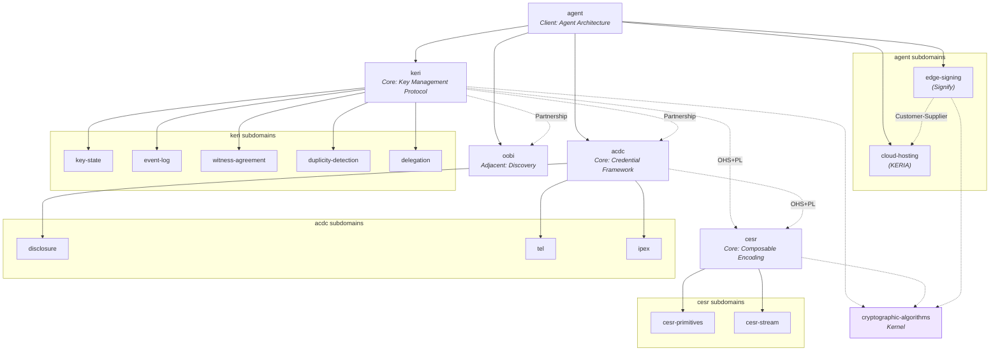

# KERI Ecosystem — Domain Specification

## System Description

KERI (Key Event Receipt Infrastructure) is a decentralized key management protocol and ecosystem for self-sovereign identity. Controllers hold private keys and generate cryptographically signed, append-only Key Event Logs (KELs) that establish and transfer control authority over Autonomic Identifiers (AIDs). Pre-rotation commits to future keys before rotation, providing post-quantum resistant recovery from key compromise. Witnesses receipt events under a first-seen consensus rule (KAWA). Watchers monitor for duplicity — inconsistent event histories that constitute a provable breach. CESR (Composable Event Streaming Representation) provides the encoding layer: self-framing, composable primitives with lossless text/binary conversion. ACDC (Authentic Chained Data Containers) provides the credential layer: cryptographically authenticatable credentials with graduated disclosure, chained via edges, with lifecycle managed by Transaction Event Logs (TELs). IPEX negotiates credential exchange. OOBIs bootstrap discovery. Agent infrastructure (KERIA + Signify) separates cloud hosting from edge signing — private keys never leave the controller.

## Domain Map

## Domains

| ID | Name | Role | Status | Terms | Description |
|----|------|------|--------|-------|-------------|
| `keri` | KERI Protocol | core | complete | 13 | Decentralized key management protocol — AID lifecycle, events, witnesses |
| `keri/key-state` | Key State | subdomain | complete | 14 | Current signing keys, thresholds, pre-rotation commitments |
| `keri/event-log` | Event Log | subdomain | complete | 18 | KEL: append-only event stream, hash-chaining, seals |
| `keri/witness-agreement` | Witness Agreement | subdomain | complete | 14 | KAWA: receipting, first-seen rule, accountability threshold |
| `keri/duplicity-detection` | Duplicity Detection | subdomain | complete | 16 | Inconsistent histories, evidence, judge/juror, recovery |
| `keri/delegation` | Delegation | subdomain | complete | 15 | Delegated AIDs, hierarchical control, custodial management |
| `cesr` | CESR Encoding | core | complete | 20 | Composable Event Streaming Representation — encoding layer |
| `cesr/cesr-primitives` | CESR Primitives | subdomain | complete | 34 | Matter/Indexer traits, Verfer–Cipher, Sadder/Serder/Creder, Tholder |
| `cesr/cesr-stream` | CESR Stream | subdomain | complete | 24 | Count codes, 12 concrete group types, parser dispatch, round-trip serialization |
| `acdc` | ACDC Credentials | core | complete | 21 | Authentic Chained Data Containers — verifiable credentials |
| `acdc/disclosure` | Disclosure | subdomain | complete | 16 | Graduated, selective, partial, full, compact disclosure |
| `acdc/tel` | Transaction Event Log | subdomain | complete | 14 | Credential state tracking — issuance, revocation, registry |
| `acdc/ipex` | IPEX Exchange | subdomain | complete | 14 | Issuance & Presentation Exchange protocol |
| `oobi` | Out-of-Band Introduction | adjacent | complete | 6 | Bootstrap discovery, BADA endpoint authorization |
| `agent` | Agent Infrastructure | client | complete | 4 | Edge/cloud separation, Signify protocol contract |
| `agent/edge-signing` | Edge Signing (Signify) | subdomain | complete | 22 | Controller-side: keepers, tiers, derivation paths, resource API, operations |
| `agent/cloud-hosting` | Cloud Hosting (KERIA) | subdomain | complete | 20 | Server-side: HIO doers, escrows, long-running ops, seeker, registrar |

## Source Material

| Type | Reference |
|------|-----------|
| document | keri-specification.md — KERI protocol specification (ToIP/IETF) |
| document | cesr-specification.md — CESR encoding specification |
| document | acdc-specification.md — ACDC credential specification |
| document | KERI_WP_2.x.web.md — KERI whitepaper v2.x |
| document | KERI_Overview.web.md — KERI protocol overview |
| document | KERI_SecurityDeepDive.web.md — security analysis |
| document | IdentifierTheory_web.md — universal identifier theory |
| document | SPAC_Message.md — privacy, authenticity, confidentiality |
| document | KERIArchGroupIssuance.md — group issuance architecture |
| document | vlei-llm-doc.md — vLEI credential ecosystem |
| document | vlei-trainings-llm-context.md — vLEI training materials |
| document | keridoc-llms-full.md — KERI documentation suite |
| document | KERIVerifiableTrustBases.web.md — verifiable trust bases |

## Skipped Domains (by user request)

| ID | Reason |
|----|--------|
| `vlei` | Application-level governance ecosystem — out of scope for protocol spec |
| `trust-model` | Foundational theory (PAC, trust bases) — not a bounded domain |
| `identifier-theory` | Foundational theory (AID/LID, Zooko) — not a bounded domain |

## Open Questions

- **TEL vs KERI relationship:** TEL anchors to the issuer's KEL, creating a tight coupling. Is TEL better modeled as an ACDC subdomain (current) or a KERI-adjacent domain?
- **OOBI scope:** Currently minimal. As endpoint authorization (BADA) grows in complexity, OOBI may need its own subdomains.
- **Cross-implementation language drift:** Terms like "Hab" (keripy), "Controller" (keriox), and "SignifyClient" (signify-ts) differ across implementations. The spec uses protocol-level terms; implementation-specific terms are not captured here.
