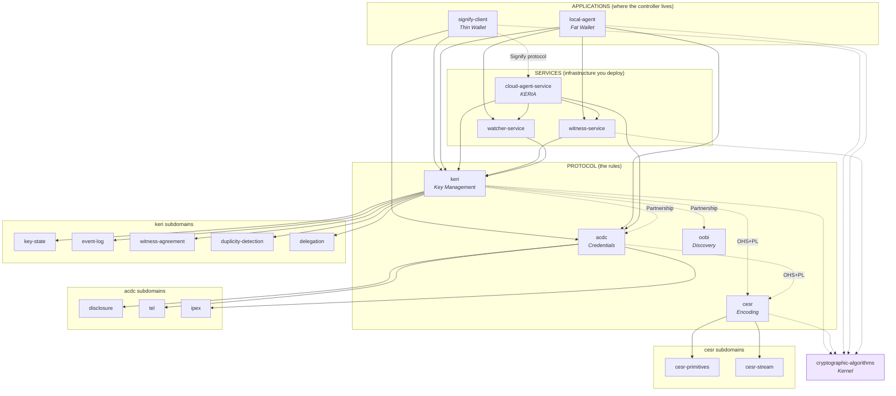

# KERI Ecosystem — Domain Specification

## System Description

KERI (Key Event Receipt Infrastructure) is a decentralized key management protocol and ecosystem for self-sovereign identity. Controllers hold private keys and generate cryptographically signed, append-only Key Event Logs (KELs) that establish and transfer control authority over Autonomic Identifiers (AIDs). Pre-rotation commits to future keys before rotation, providing post-quantum resistant recovery from key compromise. Witnesses receipt events under a first-seen consensus rule (KAWA). Watchers monitor for duplicity — inconsistent event histories that constitute a provable breach. CESR (Composable Event Streaming Representation) provides the encoding layer: self-framing, composable primitives with lossless text/binary conversion. ACDC (Authentic Chained Data Containers) provides the credential layer: cryptographically authenticatable credentials with graduated disclosure, chained via edges, with lifecycle managed by Transaction Event Logs (TELs). IPEX negotiates credential exchange. OOBIs bootstrap discovery. Agent infrastructure (KERIA + Signify) separates cloud hosting from edge signing — private keys never leave the controller.

## Domain Map

## Domains

| ID | Name | Role | Status | Terms | Description |
|----|------|------|--------|-------|-------------|
| `keri` | KERI Protocol | core | complete | 18 | Hab/Habery, Kevery, Baser, Parser, escrow architecture |
| `keri/key-state` | Key State | subdomain | complete | 1 | Key State orchestrating concept (delegates to 3 sub-subdomains) |
| `keri/key-state/commitment` | Key Commitment | sub-subdomain | complete | 7 | Pre-rotation, signing/next keys, KeyConfig, transferable/non-transferable |
| `keri/key-state/thresholds` | Threshold Logic | sub-subdomain | complete | 7 | Signing/rotation/dual/weighted thresholds, witness threshold/config |
| `keri/key-state/tracking` | Key State Tracking | sub-subdomain | complete | 7 | Kever/IdentifierState, LastEstData, state reconstruction, config traits |
| `keri/event-log` | Event Log | subdomain | complete | 16 | KEL, 5 event types, SAID, seals, field basics (orchestrates 4 sub-subdomains) |
| `keri/event-log/validation` | Event Validation | sub-subdomain | complete | 8 | Pipeline, dual threshold, pre-rotation binding, delegation validation |
| `keri/event-log/escrow` | Event Escrow | sub-subdomain | complete | 11 | Cascade, 7 escrow types, processing order, timeouts, sig accumulation |
| `keri/event-log/serialization` | Event Serialization | sub-subdomain | complete | 9 | SerderKERI, field structure, creation functions, seal types, quorum |
| `keri/event-log/storage` | Event Storage | sub-subdomain | complete | 10 | KEL schema, first-seen ordering, idempotent logging, key patterns |
| `keri/witness-agreement` | Witness Agreement | subdomain | complete | 3 | KAWA, Witness, TOAD (delegates to 3 sub-subdomains) |
| `keri/witness-agreement/consensus` | Witness Consensus | sub-subdomain | complete | 5 | First-seen rule, immune constraint, accountability, proper KERL, BFT quorum |
| `keri/witness-agreement/receipting` | Witness Receipting | sub-subdomain | complete | 5 | Receipt types, escrows, receipt generator, KERL |
| `keri/witness-agreement/dissemination` | Witness Dissemination | sub-subdomain | complete | 6 | Round-robin, gossip, designation, policy, direct/indirect mode |
| `keri/duplicity-detection` | Duplicity Detection | subdomain | complete | 5 | Duplicity, internal inconsistency, live/dead attacks (delegates to 3 sub-subdomains) |
| `keri/duplicity-detection/evidence` | Duplicity Evidence | sub-subdomain | complete | 5 | Fork detection, LDE/DEL, notification bus |
| `keri/duplicity-detection/recovery` | Superseding Recovery | sub-subdomain | complete | 5 | Superseding rules A0-C, reconciliation, trunk/branch |
| `keri/duplicity-detection/monitoring` | Duplicity Monitoring | sub-subdomain | complete | 5 | Watcher, juror, judge, ambient detection, eclipse attack |
| `keri/delegation` | Delegation | subdomain | complete | 4 | dip/drt event types, delegation chain, DID trait (delegates to 3 sub-subdomains) |
| `keri/delegation/binding` | Delegation Binding | sub-subdomain | complete | 8 | Cooperative delegation, seals, di field, two-way binding, seal source |
| `keri/delegation/recovery` | Delegation Recovery | sub-subdomain | complete | 4 | Joint compromise, superseding rules B1-B3-C, custodial delegation |
| `keri/delegation/validation` | Delegation Validation | sub-subdomain | complete | 4 | Validation pipeline, PDE/delegable/approved escrows |
| `cesr` | CESR Encoding | core | complete | 20 | Composable Event Streaming Representation — encoding layer |
| `cesr/cesr-primitives` | CESR Primitives | subdomain | complete | 34 | Matter/Indexer traits, Verfer–Cipher, Sadder/Serder/Creder, Tholder |
| `cesr/cesr-stream` | CESR Stream | subdomain | complete | 24 | Count codes, 12 concrete group types, parser dispatch, round-trip serialization |
| `acdc` | ACDC Credentials | core | complete | 27 | SerderACDC/Creder, Schemer, Verifier, credential indexing/artifacts |
| `acdc/disclosure` | Disclosure | subdomain | complete | 1 | Graduated Disclosure orchestrator (delegates to 3 sub-subdomains) |
| `acdc/disclosure/modes` | Disclosure Modes | sub-subdomain | complete | 6 | Compact, partial, nested, full, selective, chain-link |
| `acdc/disclosure/privacy` | Disclosure Privacy | sub-subdomain | complete | 5 | Metadata/private/public ACDC, blinded blocks, bulk issuance |
| `acdc/disclosure/aggregation` | Disclosure Aggregation | sub-subdomain | complete | 6 | AGID, inclusion proof, oneOf, most compact form, Compactor, SAD path sigs |
| `acdc/tel` | Transaction Event Log | subdomain | complete | 11 | TEL, Registry, event types, Regery/Tevery (orchestrates 4 sub-subdomains) |
| `acdc/tel/state` | TEL State Management | sub-subdomain | complete | 6 | Credential FSM, registry state, Tever, state reconstruction |
| `acdc/tel/validation` | TEL Validation | sub-subdomain | complete | 6 | Validation pipeline, verifiable events, escrows, KEL anchor check |
| `acdc/tel/blinding` | TEL Blinding | sub-subdomain | complete | 8 | BLID, blinded blocks, shared secret, UUID derivation, decorrelation |
| `acdc/tel/storage` | TEL Storage | sub-subdomain | complete | 6 | Reger schema, credential/escrow storage, key patterns, registry metadata |
| `acdc/ipex` | IPEX Exchange | subdomain | complete | 1 | IPEX orchestrating concept (delegates to 3 sub-subdomains) |
| `acdc/ipex/negotiation` | IPEX Negotiation | sub-subdomain | complete | 9 | Apply/offer/agree/grant/admit/spurn, direct vs full flow |
| `acdc/ipex/verification` | IPEX Verification | sub-subdomain | complete | 4 | PoI, PoD, credential artifacts, KRAM authentication |
| `acdc/ipex/messaging` | IPEX Messaging | sub-subdomain | complete | 4 | Exchanger, IPEX Handler, message construction, EXN format |
| `oobi` | Out-of-Band Introduction | adjacent | complete | 6 | Bootstrap discovery, BADA endpoint authorization |
| | | | | | |
| **SERVICES** | | | | | |
| `cloud-agent-service` | Cloud Agent Service (KERIA) | service | complete | 21 | Multi-tenant AID hosting, admin API, message router, long-running ops |
| `witness-service` | Witness Service | service | complete | 6 | Witness nodes, receipt generation, KERL storage, pool deployment |
| `watcher-service` | Watcher Service | service | complete | 5 | Watcher nodes, KEL cross-check, duplicity alerts, pool deployment |
| | | | | | |
| **APPLICATIONS** | | | | | |
| `signify-client` | Signify Client (Thin Wallet) | application | complete | 22 | Keepers, tiers, derivation paths, resource API, Signify protocol |
| `local-agent` | Local Agent (Fat Wallet) | application | complete | 8 | Hab/Habery, local Kevery, local Baser, direct witness/watcher comms |
| | | | | | |
| **DEPRECATED** | | | | | |
| `agent` | ~~Agent Infrastructure~~ | deprecated | — | — | Replaced by signify-client + local-agent + cloud-agent-service |

## Source Material

| Type | Reference |
|------|-----------|
| document | keri-specification.md — KERI protocol specification (ToIP/IETF) |
| document | cesr-specification.md — CESR encoding specification |
| document | acdc-specification.md — ACDC credential specification |
| document | KERI_WP_2.x.web.md — KERI whitepaper v2.x |
| document | KERI_Overview.web.md — KERI protocol overview |
| document | KERI_SecurityDeepDive.web.md — security analysis |
| document | IdentifierTheory_web.md — universal identifier theory |
| document | SPAC_Message.md — privacy, authenticity, confidentiality |
| document | KERIArchGroupIssuance.md — group issuance architecture |
| document | vlei-llm-doc.md — vLEI credential ecosystem |
| document | vlei-trainings-llm-context.md — vLEI training materials |
| document | keridoc-llms-full.md — KERI documentation suite |
| document | KERIVerifiableTrustBases.web.md — verifiable trust bases |

## Skipped Domains (by user request)

| ID | Reason |
|----|--------|
| `vlei` | Application-level governance ecosystem — out of scope for protocol spec |
| `trust-model` | Foundational theory (PAC, trust bases) — not a bounded domain |
| `identifier-theory` | Foundational theory (AID/LID, Zooko) — not a bounded domain |

## Open Questions

- **TEL vs KERI relationship:** TEL anchors to the issuer's KEL, creating a tight coupling. Is TEL better modeled as an ACDC subdomain (current) or a KERI-adjacent domain?
- **OOBI scope:** Currently minimal. As endpoint authorization (BADA) grows in complexity, OOBI may need its own subdomains.
- **Cross-implementation language drift:** Terms like "Hab" (keripy), "Controller" (keriox), and "SignifyClient" (signify-ts) differ across implementations. The spec uses protocol-level terms; implementation-specific terms are not captured here.
